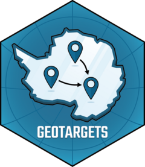

<!-- README.md is generated from README.Rmd. Please edit that file -->

```{r, include = FALSE}
knitr::opts_chunk$set(
  collapse = TRUE,
  comment = "#>",
  fig.path = "man/figures/README-",
  out.width = "100%"
)
```

# geotargets <a href="http://geotargets.njtierney.com/"></a> 

<!-- badges: start -->
[](https://www.repostatus.org/#active)
[](https://wlandau.github.io/targetopia/)
[](https://github.com/njtierney/geotargets/actions/workflows/R-CMD-check.yaml)
[](https://app.codecov.io/gh/njtierney/geotargets?branch=master)
[](https://github.com/njtierney/geotargets/actions?query=workflow%3Apkgcheck)
[](https://github.com/ropensci/software-review/issues/675)
<!-- badges: end -->

`geotargets` extends [`targets`](https://github.com/ropensci/targets) to work with geospatial data formats, such as rasters and vectors (e.g., shapefiles). Currently we support raster and vector formats for the [`terra`](https://github.com/rspatial/terra) package. 

If you are unfamiliar with targets, we recommend watching ["targets in 4 minutes"](https://docs.ropensci.org/targets/#get-started-in-4-minutes).

## How to cite geotargets

One example citation of geotargets could be as follows: "R packages used in this analysis included (list R packages used), targets, and geotargets (Tierney, N., Scott, E., & Brown, A, 2024). Here is the full bibliographic reference for your references:

> Tierney N, Scott E, Brown A
  (2024). "geotargets: 'Targets'
  Extensions for Geospatial
  Formats."
  <http://geotargets.njtierney.com>.

## Installation

You can install the development version of geotargets like so:

``` r
install.packages("geotargets", repos = c("https://njtierney.r-universe.dev", "https://cran.r-project.org"))
```

## Why `geotargets`

If you want to use geospatial data formats (such as `terra`) with the [`targets`](https://github.com/ropensci/targets) package to build analytic reproducible pipelines, it involves writing a lot of custom targets wrappers. We wrote `geotargets` so you can use geospatial data formats with `targets`.

To provide more detail on this, a common problem when using popular libraries like `terra` with `targets` is running into errors with read and write. Due to the limitations that come with the underlying C++ implementation in the `terra` library, there are specific ways to write and read these objects. See `?terra` for details. `geotargets` helps handle these write and read steps, so you don't have to worry about them and can use targets as you are used to.

In essence, if you've ever come across the error:

```
Error in .External(list(name = "CppMethod__invoke_notvoid", address = <pointer: 0x0>,  : 
  NULL value passed as symbol address
```

or 

```
Error: external pointer is not valid
```

When trying to read in a geospatial raster or vector in targets, then `geotargets` for you :)

# Examples

We currently provide support for the `terra` package with `targets`. Below we show three examples of target factories:

- `tar_terra_rast()`
- `tar_terra_vect()`
- `tar_terra_sprc()`
- `tar_terra_sds()`
- `tar_tera_tiles()`
- `tar_stars()`

You would use these in place of `tar_target()` in your targets pipeline, e.g., when you are doing work with `terra` raster, vector, or raster collection data.

If you would like to see and download working examples for yourself, see the repos: 

- [demo-geotargets](https://github.com/njtierney/demo-geotargets)
- [icebreaker](https://github.com/njtierney/icebreaker)

## `tar_terra_rast()`: targets with terra rasters

```{r}
#| label: tar-terra-rast
library(targets)

tar_dir({ # tar_dir() runs code from a temporary directory.
  tar_script({
    library(geotargets)

    get_elev <- function() {
      terra::rast(system.file("ex", "elev.tif", package = "terra"))
    }

    list(
      tar_terra_rast(
        terra_rast_example,
        get_elev()
      )
    )
  })

  tar_make()
  x <- tar_read(terra_rast_example)
  x
})
```


## `tar_terra_vect()`: targets with terra vectors

```{r}
#| label: tar-terra-vect
tar_dir({ # tar_dir() runs code from a temporary directory.
  tar_script({
    library(geotargets)

    lux_area <- function(projection = "EPSG:4326") {
      terra::project(
        terra::vect(system.file("ex", "lux.shp",
          package = "terra"
        )),
        projection
      )
    }

    list(
      tar_terra_vect(
        terra_vect_example,
        lux_area()
      )
    )
  })

  tar_make()
  x <- tar_read(terra_vect_example)
  x
})
```


## `tar_terra_sprc()`: targets with terra raster collections

```{r}
#| label: tar-terra-sprc
tar_dir({ # tar_dir() runs code from a temporary directory.
  tar_script({
    library(geotargets)

    elev_scale <- function(z = 1, projection = "EPSG:4326") {
      terra::project(
        terra::rast(system.file("ex", "elev.tif", package = "terra")) * z,
        projection
      )
    }

    list(
      tar_terra_sprc(
        raster_elevs,
        # two rasters, one unaltered, one scaled by factor of 2 and
        # reprojected to interrupted goode homolosine
        command = terra::sprc(list(
          elev_scale(1),
          elev_scale(2, "+proj=igh")
        ))
      )
    )
  })

  tar_make()
  x <- tar_read(raster_elevs)
  x
})
```


## `tar_stars()`: targets with stars objects

```{r}
#| label: tar-stars
tar_dir({ # tar_dir() runs code from a temporary directory.
  tar_script({
    library(geotargets)

    list(
      tar_stars(
        test_stars,
        stars::read_stars(system.file("tif", "olinda_dem_utm25s.tif", package = "stars"))
      )
    )
  })

  tar_make()
  x <- tar_read(test_stars)
  x
})
```


## Code of Conduct

Please note that the geotargets project is released with a [Contributor Code of Conduct](https://ropensci.org/code-of-conduct/). By contributing to this project, you agree to abide by its terms.

## Acknowledgements

Logo design by Hubert Hałun at Appsilon.
